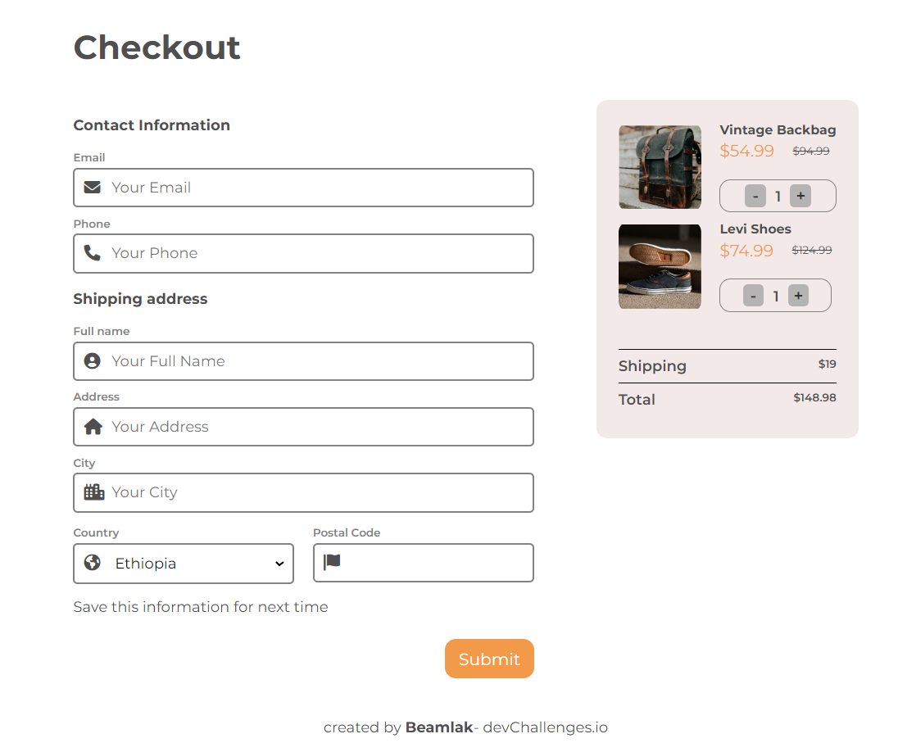

<!-- Please update value in the {}  -->

<h1 align="center">My Gallery</h1>

   Solution for a challenge from  <a href="http://devchallenges.io" target="_blank">Devchallenges.io</a>.

  <h3>
    <a href="https://{your-demo-link.your-domain}" target="_blank">
      Demo
    </a>
     | 
    <a href="https://{your-url-to-the-solution}" target="_blank">
      Solution
    </a>
     | 
    <a href="https://devchallenges.io/challenges/0J1NxxGhOUYVqihwegfO" target="_blank">
      Challenge
    </a>
  </h3>

<!-- TABLE OF CONTENTS -->

## Table of Contents

- [Overview](#overview)
  - [Built With](#built-with)
- [Features](#features)
- [Acknowledgements](#acknowledgements)

<!-- OVERVIEW -->

## Overview

### Built With

<!-- This section should list any major frameworks that you built your project using. Here are a few examples.-->

- Html
- Css

## Features

<!-- List the features of your application or follow the template. Don't share the figma file here :) -->

This application/site was created as a submission to a [DevChallenges](https://devchallenges.io/challenges) challenge. The [challenge](https://devchallenges.io/challenges/wBunSb7FPrIepJZAg0sY) was to build an application to complete the given user stories.

- User story: I can see a page following the given design
- User story: I can input email, phone, full name, address, city, country, and postal codeI can see a page following the given design
- User story: I can input the number of items
- User story:  I can select at least 3 countries from the dropdown
- User story: When I click submit button or press enter, I can see a warning if validation fails
- User story: When I click submit button or press enter, I can see a successful alert if validation succeeds

## Acknowledgements
- [SweetAlert2 - a beautiful, responsive and customizable JS popup boxes ](https://sweetalert2.github.io/)

